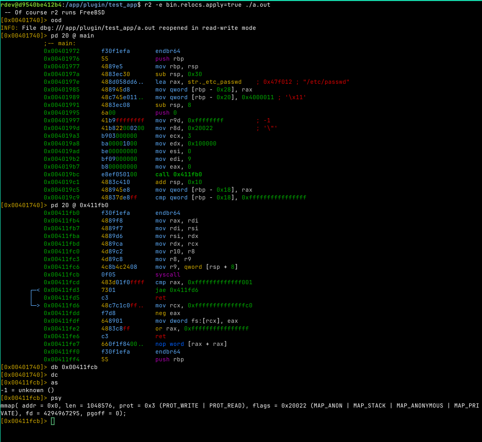

# SysReader, a Radare2 Syscall Parsing Helper

When reverse engineering Linux malware, a painful part of the job is figuring out what a specific syscall is doing. This can be hard to do at a glace, especially if you are not willing to analyse it in an environment with:
* an internet connection
* a local LLM to help with reversing

The program is rather simple despite being in its early stages. At the moment, when encountering a syscall, it will read the value of RAX and pass that to Radare's own `ask` command to get the syscall name and argument paramters. The plugin then parses each argument, which fortunately, is limited to a subset of .

An example of the plugin in action is shown below:

The syscall argument flags are mainly parsed by querying a JSON file that accompanies the plugin's shared object. This allows us to have a growing number of supported syscalls. Currently, a development goal that I have for this plugin is to gain more coverage for syscalls within the standard Linux Kernel.

## Why not just use something that leverages the eBPF filters

While eBPF is certainly great and would make working with syscalls much easier, it is reliant on the call being made. This plugin is focused on making sure that you are able to tell what the call is going to do before it is executed.

## Development goals

The plugin is still in its MVP (minimal viable product) phase, future development objectives are listed below:
* Expanded coverage of standard linux kernel syscalls and flags
* Expansion beyond x86_64 to account for syscalls to cover ARM and other popular architectures
* Struct dereferencing to deal with more complex syscalls like `clone3`, which uses a struct to hold other parameters because the actual paramter could would be much higher than the limitations that are normally associated with syscall arguments

